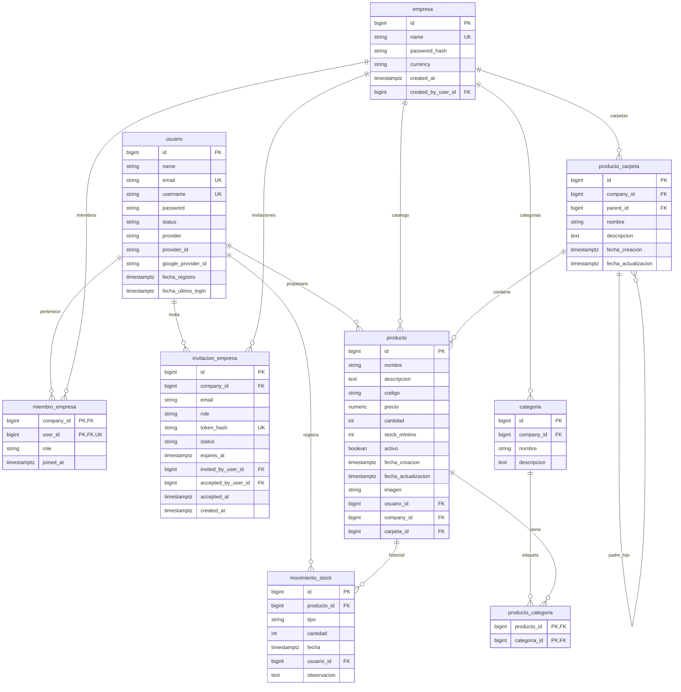
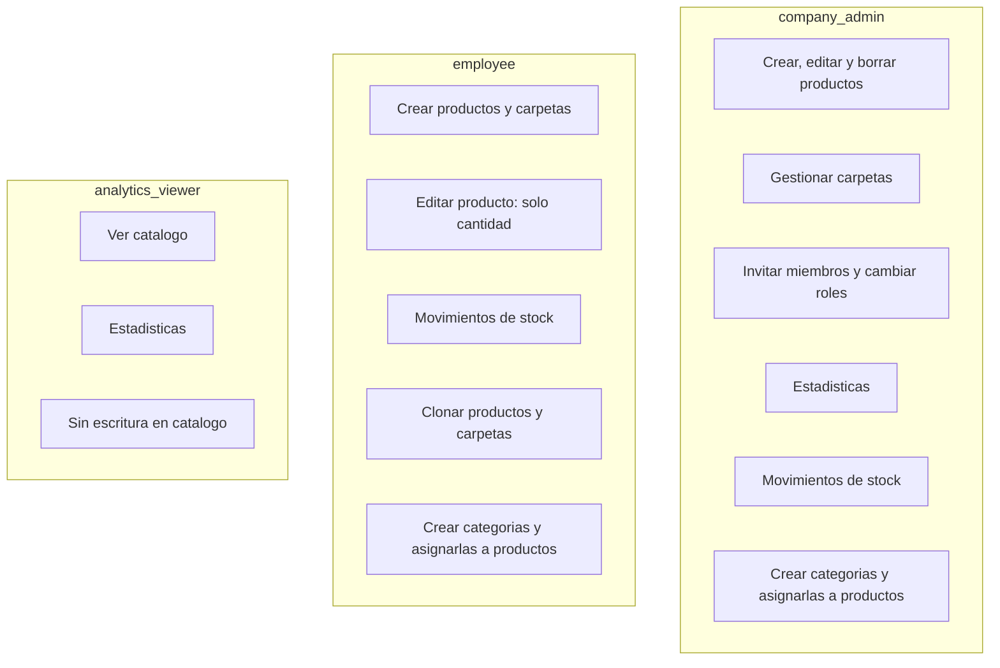
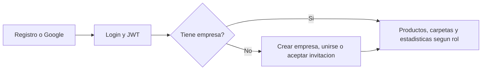
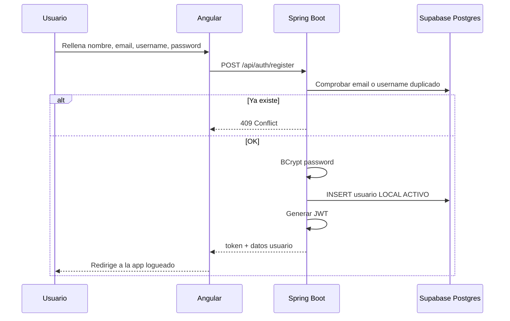
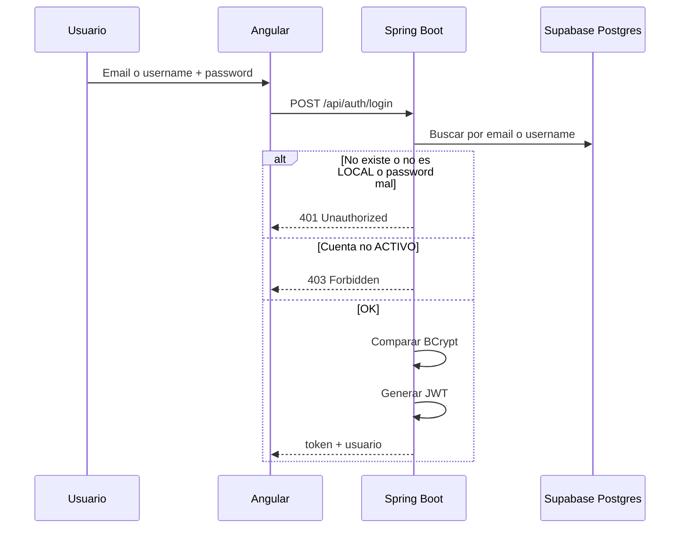
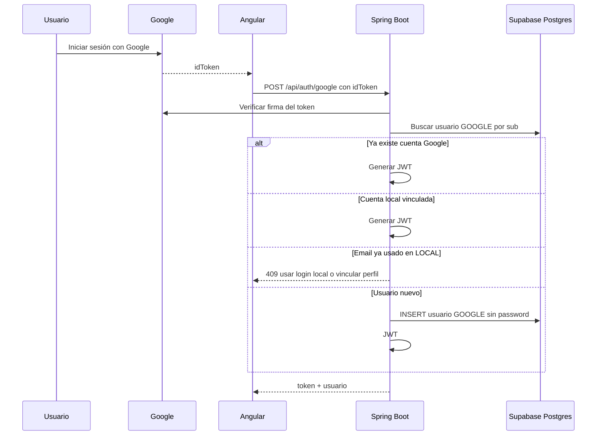
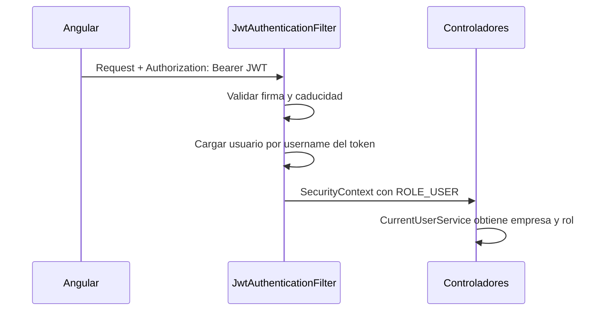
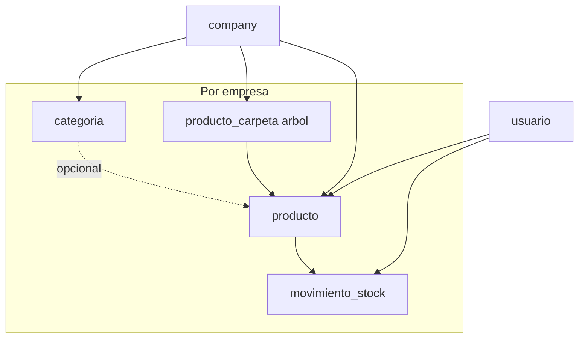
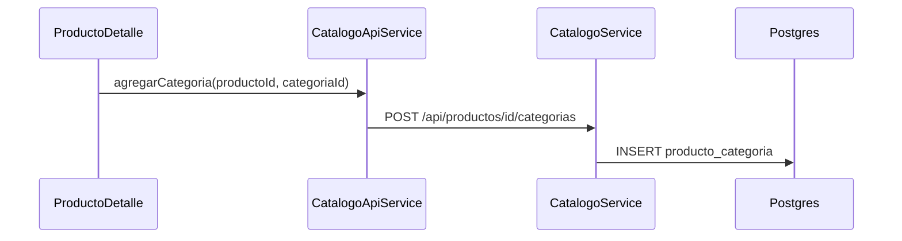

# StoRy — Guía técnica (2º DAM)

Hola. Este documento resume cómo está montado **StoRy** a nivel de base de datos, autenticación y permisos.

---

## 1. Tecnologías del proyecto

| Capa | Tecnología | Para qué la usamos |
|------|------------|-------------------|
| **Frontend** | Angular 21 | SPA, rutas, formularios, llamadas HTTP al API |
| **Backend** | Spring Boot 3.5 (Java 17) | API REST, seguridad, lógica de negocio |
| **Base de datos** | PostgreSQL en **Supabase** | Datos persistentes (usuarios, productos, empresas…) |
| **ORM** | Spring Data JPA / Hibernate | Mapear tablas ↔ clases Java |
| **Almacenamiento** | Supabase Storage | Imágenes de productos (bucket público `imagenes`) |
| **Auth** | JWT (JSON Web Token) | Sesión stateless tras login/registro |
| **Contraseñas** | BCrypt | Hashear passwords locales |
| **Google** | Google Identity (ID token) | Login/registro con cuenta Google |
| **Emails** | Resend | Invitaciones a empresa |
| **Tests backend** | H2 en memoria | Tests sin tocar Supabase (10 clases de test en `backend/src/test`) |
| **Build** | Maven (`mvnw`) + npm | Backend y frontend por separado |

**Arquitectura resumida:** el navegador (Angular en `localhost:4200`) habla con el backend (Spring en `localhost:8080`) mediante un **proxy** en desarrollo. El backend es quien se conecta a Postgres en Supabase con las credenciales del `.env`.

---

## 2. Modelo de datos — tablas y relaciones

La app es **multi-empresa**: casi todo el inventario cuelga de una `company`. Un usuario solo puede pertenecer a **una** empresa a la vez (`company_member` tiene `UNIQUE` en `user_id`).

### 2.1 Diagrama entidad-relación

> **Nota:** en PostgreSQL las tablas de empresa se llaman `company`, `company_member` e `company_invitation` (nombres en inglés en el esquema). Los roles van por `company_member.role`: `company_admin`, `employee`, `analytics_viewer`.

### 2.2 Qué hace cada tabla (en cristiano)

| Tabla | Qué guarda |
|-------|------------|
| **usuario** | Personas que entran en StoRy. Pueden ser `LOCAL` (email + password) o `GOOGLE`. Estados: `ACTIVO`, `BLOQUEADO`, `ELIMINADO`. |
| **company** | Empresa / organización. Tiene nombre único, moneda (`EUR`, `USD`, `JPY`, `CNY`) y **contraseña de empresa** (hash) para que otros se unan. |
| **company_member** | Quién está en qué empresa y con qué **rol**. Un usuario = una fila como máximo. |
| **company_invitation** | Invitación por email con token, rol asignado y caducidad (7 días). |
| **categoria** | Etiquetas opcionales para productos, **por empresa**. El nombre es único dentro de la misma empresa (`company_id` + `nombre`). |
| **producto** | Artículo de inventario. Código único **por empresa** (`company_id` + `codigo`). Imagen = URL pública en Supabase Storage. Puede tener **varias categorías** vía `producto_categoria`. |
| **producto_categoria** | Tabla N:M entre producto y categoría (un producto puede tener varias etiquetas). |
| **producto_carpeta** | Carpetas tipo árbol dentro de una empresa (pueden anidarse con `parent_id`; sin columna de imagen). |
| **movimiento_stock** | Historial: cada entrada, salida o ajuste de stock, con usuario y fecha. |

### 2.3 Reglas importantes de integridad

- Si borras una **empresa**, en cascada se van miembros, invitaciones, carpetas y **categorías**.
- Un **producto** no puede quedarse huérfano de empresa (`company_id` obligatorio).
- El **código** de producto es único dentro de la misma empresa, no en todo el mundo.
- Una **categoría** pertenece a una sola empresa; las etiquetas de un producto se gestionan en `producto_categoria` (cero o más filas por producto).
- **movimiento_stock** se borra si se borra el producto (`ON DELETE CASCADE`).
- Una carpeta con productos dentro no se borra a la ligera (`carpeta_id` en producto con `RESTRICT`); el admin borra la carpeta y la app elimina productos del subárbol.

---

## 3. Roles de empresa

En el día a día usamos **`CompanyRole`** (tabla `company_member`):

| Rol | Nombre en BD | En la práctica |
|-----|--------------|----------------|
| **Administrador** | `company_admin` | Control total del inventario de la empresa: crear/editar/borrar productos y carpetas, invitar gente, ver estadísticas. |
| **Empleado** | `employee` | Puede trabajar con productos y carpetas, pero al **editar** un producto solo puede cambiar la **cantidad** (no nombre, precio, imagen…). No borra productos ni carpetas. |
| **Analítica** | `analytics_viewer` | Casi solo lectura: **no** puede crear/editar productos ni carpetas. **Sí** puede ver la pantalla de **estadísticas** de inventario. |

### 3.1 Diagrama de permisos (simplificado)

### 3.2 Flujo típico de un usuario nuevo

- **Crear empresa:** el usuario pasa a ser `company_admin` y sus productos “sueltos” se migran a esa empresa.
- **Unirse:** nombre de empresa + contraseña de empresa → entra como `employee`.
- **Invitación:** el admin manda email (Resend); el invitado acepta con el token → rol el que puso el admin.
- **Cambio de rol:** `PATCH /api/company/members/{userId}/role` (solo `company_admin`).

---

## 4. Autenticación — registro, login y Google

Toda la auth pasa por el **backend**. El frontend guarda el **JWT** y lo manda en el header `Authorization: Bearer …` en las rutas protegidas.

### 4.1 Registro local (`POST /api/auth/register`)

### 4.2 Login local (`POST /api/auth/login`)

### 4.3 Login con Google (`POST /api/auth/google`)

El frontend obtiene un **ID token** de Google (botón de Google Sign-In) y lo manda al backend. **Nosotros no guardamos el token de Google**, solo verificamos que sea válido y leemos `sub`, email y nombre.

**Vincular Google después:** desde perfil, usuario `LOCAL` autenticado → `POST /api/account/link-google` con otro `idToken`. Se guarda `google_provider_id` para poder entrar con Google sin duplicar cuenta.

### 4.4 Cómo viaja el JWT en cada petición

Rutas del frontend con `authGuard` (productos, perfil, empresa, categorías…) exigen token válido. **Estadísticas** usa `estadisticasGuard` (admin o analítica). En el backend, `/api/categorias` también exige autenticación (ya no es pública).

---

## 5. Inventario — flujo de datos

- Al **crear** un producto con cantidad inicial, se suele generar un movimiento `ENTRADA` (“Stock inicial”).
- Al **editar** cantidad, se registran entradas/salidas/ajustes según la diferencia.
- Tipos de movimiento: `ENTRADA`, `SALIDA`, `AJUSTE`.

### 5.1 Categorías y productos (N:M)

Las categorías son **etiquetas opcionales** por empresa. Un producto puede tener **cero o varias** categorías (`producto_categoria`).

**Esquema en Supabase (resumen):** categorías por empresa (`categoria.company_id`); relación N:M `producto_categoria`; imágenes de producto en bucket Storage `imagenes` (JPEG/PNG/GIF/WebP, máx. 5 MB). Los cambios de esquema se aplican en el proyecto Supabase, no desde este repositorio.

**API de catálogo (JWT + empresa; escritura según rol):**

| Método | Ruta | Qué hace |
|--------|------|----------|
| `GET` | `/api/categorias` | Lista categorías de la empresa |
| `POST` | `/api/categorias` | Crea categoría (`employee`+) |
| `GET` | `/api/productos?carpetaId=&categoriaId=&bajoMinimo=` | Lista por carpeta/categoría o bajo mínimo |
| `GET` | `/api/productos/todos` | Catálogo completo de la empresa |
| `GET` | `/api/productos/bajo-minimo` | Alias legacy de bajo mínimo |
| `POST` | `/api/productos/{id}/categorias` | Añade categoría (`categoriaId` o `nombre` nuevo) |
| `DELETE` | `/api/productos/{id}/categorias/{categoriaId}` | Quita una etiqueta |
| `PATCH` | `/api/productos/{id}/stock-minimo` | Actualiza umbral de alerta |
| `POST` / `POST .../update` | multipart | Crear/actualizar producto con imagen opcional |

**API de estadísticas** (`GET /api/productos/estadisticas`, `company_admin` o `analytics_viewer`):

| Parámetro | Uso |
|-----------|-----|
| `desde`, `hasta` | Rango de fechas (obligatorio) |
| `categoriaIds` | Lista de IDs de categoría (varios) |
| `carpetaIds` | Lista de IDs de carpeta |
| `categoriaRaiz=true` | Solo productos **sin** ninguna categoría |
| `carpetaRaiz=true` | Solo productos **sin** carpeta (raíz del catálogo) |
| `categoriaId` | Compatibilidad: un solo ID (legacy) |

Respuesta: totales de movimientos, unidades y valor por tipo, productos bajo mínimo, serie diaria y top de salidas (`InventarioEstadisticasResponse`).

**Frontend:**

| Ruta | Comportamiento |
|------|----------------|
| `/producto/:id` | Ficha: edición según rol, categorías múltiples, movimientos, imagen |
| `/productos` | Árbol de carpetas, filtros, resumen de stock, CRUD según rol |
| `/stock-bajo` | Listado de alertas de stock mínimo |
| `/estadisticas` | KPIs, gráficos y filtros múltiples de categoría/carpeta |
| `/categorias` | Consulta de categorías |
| `/empresa` | Miembros, invitaciones y cambio de roles (admin) |

**Fuera de alcance actual:** editar/eliminar categorías desde UI o API dedicada.

---

## 6. Dónde mirar en el código (por si defiendes el proyecto)

| Tema | Ubicación |
|------|-----------|
| Entidades JPA | `backend/src/main/java/com/story/model/` |
| Auth | `AuthService`, `AuthController` |
| Empresa e invitaciones | `CompanyService`, `CompanyController` |
| Productos y permisos | `CatalogoService`, `ProductoController` |
| Categorías N:M | `CategoriaController`, `CatalogoService.agregarProductoCategoria`, `quitarProductoCategoria` |
| Imágenes Storage | `FileStorageService`, `SupabaseProperties` |
| Carpetas | `CarpetaService`, `CarpetaController` |
| Estadísticas | `InventarioService.estadisticas`, `ProductoController` (`categoriaIds`, `carpetaIds`, raíz) |
| Empresa y roles | `CompanyService.updateMemberRole`, `CompanyController` |
| Usuario actual y roles | `CurrentUserService` |
| Rutas Angular | `frontend/src/app/app.routes.ts` |
| Guards | `frontend/src/app/core/guards/auth.guard.ts` |
| API catálogo (frontend) | `catalogo-api.service.ts`, `company-api.service.ts` |
| Pantallas | `productos`, `producto-detalle`, `estadisticas`, `stock-bajo-minimo`, `company`, `home` |

---

## 7. Supabase en nuestro setup

- La base **no está en Docker local**: está en un proyecto Supabase.
- El backend se conecta con el **Session pooler** (IPv4), variables `SPRING_DATASOURCE_*` en `.env`.
- **RLS** está activado en las tablas: si alguien usara la API REST de Supabase con la clave `anon`, no vería filas sin políticas. Nuestro backend usa el rol `postgres` por JDBC y no depende de esas políticas.
- El **esquema PostgreSQL** se mantiene en Supabase (este repo no incluye scripts de migración). Hibernate valida el modelo al arrancar (`ddl-auto: validate`).
- Variables en `.env`: `SUPABASE_URL`, `SUPABASE_SERVICE_ROLE_KEY`, `SPRING_DATASOURCE_*`, `GOOGLE_CLIENT_ID`, `RESEND_*` (ver `.env.example`).

---